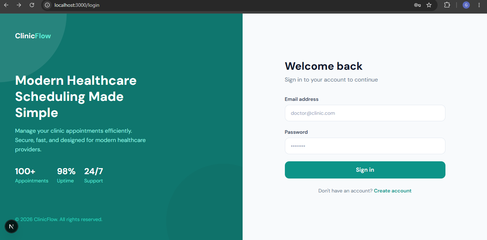
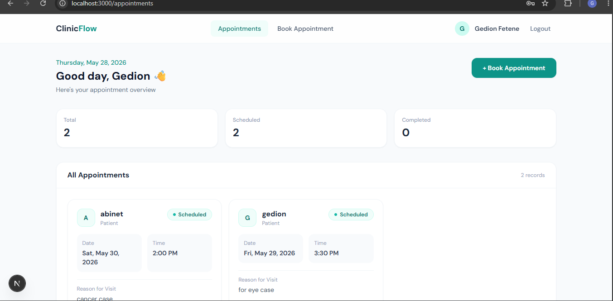
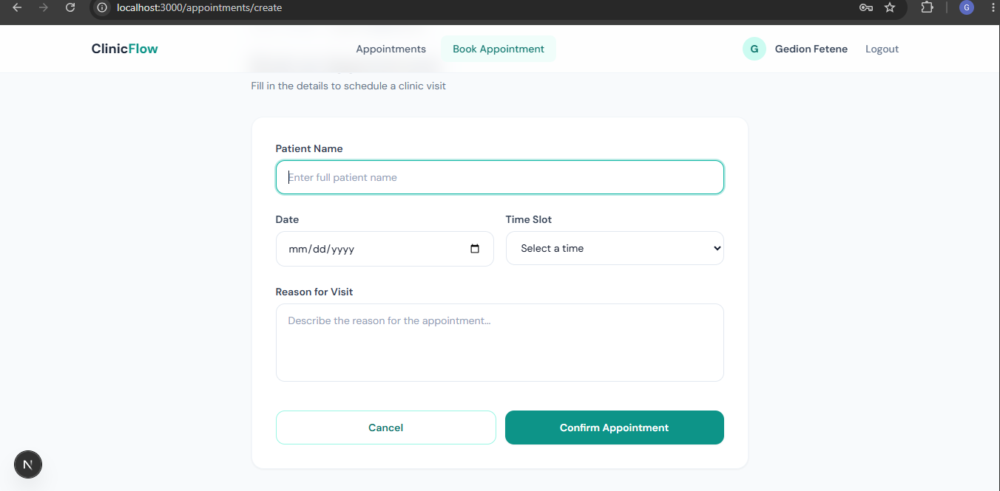

<div align="center">

# 🏥 ClinicFlow

### A Modern Full-Stack Clinic Appointment Management System


**A production-quality full-stack web application built as a technical assessment submission.**
Clean architecture · JWT Authentication · Responsive UI · TypeScript throughout

[Live Demo](#) · [Report Bug](https://github.com/Gedion48/clinic-appointment-system/issues) · [Request Feature](https://github.com/Gedion48/clinic-appointment-system/issues)

</div>

---

## 📸 Screenshots

### 🔐 Login Page



### 📊 Appointments Dashboard



### 📅 Book Appointment



---

## ✨ Features

- 🔐 **JWT Authentication** — Secure register & login with bcryptjs password hashing (12 salt rounds)
- 🛡️ **Protected Routes** — Middleware guards on both frontend layout and backend API
- 📅 **Appointment Management** — Create and view all your clinic appointments
- 📊 **Dashboard Stats** — Live count of total, scheduled, and completed appointments
- 🔔 **Toast Notifications** — Real-time success and error feedback on every action
- ⚡ **Axios Interceptors** — Auto JWT attachment on all requests + automatic 401 logout redirect
- 📱 **Fully Responsive** — Optimized for mobile, tablet, and desktop screens
- 🎨 **Modern Healthcare UI** — Clean teal design system with Tailwind CSS utility classes
- 🔄 **Loading & Empty States** — Professional UX with animated spinners and empty state screens
- 🧹 **Clean Architecture** — Modular controllers, services, and reusable component layers

---

## 🛠️ Tech Stack

### Frontend

| Technology           | Version | Purpose                                        |
| -------------------- | ------- | ---------------------------------------------- |
| Next.js (App Router) | 15.x    | React framework with file-based routing        |
| TypeScript           | 5.x     | Full type safety across all files              |
| Tailwind CSS         | 3.x     | Utility-first responsive styling               |
| Axios                | 1.x     | HTTP client with request/response interceptors |
| react-hot-toast      | 2.x     | Beautiful toast notification system            |

### Backend

| Technology            | Version | Purpose                               |
| --------------------- | ------- | ------------------------------------- |
| Node.js               | 18+     | JavaScript runtime environment        |
| Express.js            | 4.x     | RESTful API server framework          |
| MongoDB + Mongoose    | 8.x     | NoSQL database with schema validation |
| JSON Web Tokens (JWT) | 9.x     | Stateless user authentication         |
| bcryptjs              | 2.x     | Secure password hashing (12 rounds)   |
| dotenv                | 16.x    | Environment variable management       |
| cors                  | 2.x     | Cross-origin request handling         |
| nodemon               | 3.x     | Development server auto-reload        |

---

## 📁 Project Structure

```
clinic-appointment-system/
├── backend/
│   ├── config/
│   │   └── db.js                    # MongoDB connection setup
│   ├── controllers/
│   │   ├── authController.js        # Register & Login business logic
│   │   └── appointmentController.js # Appointment CRUD logic
│   ├── middleware/
│   │   └── auth.js                  # JWT token verification middleware
│   ├── models/
│   │   ├── User.js                  # User schema (name, email, password)
│   │   └── Appointment.js           # Appointment schema with timestamps
│   ├── routes/
│   │   ├── auth.js                  # POST /api/auth/register, /login
│   │   └── appointments.js          # GET, POST /api/appointments
│   ├── .env.example                 # Environment variable template (safe to share)
│   ├── .gitignore
│   ├── package.json
│   └── server.js                    # Express app entry point
│
└── frontend/
    ├── app/
    │   ├── globals.css              # Global styles + Tailwind layers
    │   ├── layout.tsx               # Root layout + Toast provider
    │   ├── page.tsx                 # Root redirect → /appointments
    │   ├── login/
    │   │   └── page.tsx             # Login page (split panel design)
    │   ├── register/
    │   │   └── page.tsx             # Registration page
    │   └── appointments/
    │       ├── layout.tsx           # Auth guard + Navbar wrapper
    │       ├── page.tsx             # Appointments dashboard
    │       └── create/
    │           └── page.tsx         # Book appointment form
    ├── components/
    │   ├── Navbar.tsx               # Top nav with user info + logout
    │   ├── AppointmentCard.tsx      # Individual appointment card
    │   ├── LoadingSpinner.tsx       # Reusable animated spinner
    │   └── EmptyState.tsx           # Empty state with CTA button
    ├── services/
    │   ├── authService.ts           # Login & register API calls
    │   └── appointmentService.ts    # Appointment API calls
    ├── lib/
    │   ├── axios.ts                 # Axios instance + interceptors
    │   └── auth.ts                  # localStorage JWT helpers
    ├── types/
    │   └── index.ts                 # TypeScript interfaces & types
    ├── middleware.ts                 # Next.js route middleware
    ├── .env.local.example           # Frontend env template (safe to share)
    ├── .gitignore
    ├── next.config.js
    ├── tailwind.config.ts
    ├── postcss.config.js
    └── tsconfig.json
```

---

## ⚙️ Environment Variables

### Backend — create `backend/.env`

```env
PORT=5000
MONGODB_URI=mongodb://localhost:27017/clinic_appointments
JWT_SECRET=your_super_secret_jwt_key_change_this
JWT_EXPIRES_IN=7d
NODE_ENV=development
CLIENT_URL=http://localhost:3000
```

### Frontend — create `frontend/.env.local`

```env
NEXT_PUBLIC_API_URL=http://localhost:5000/api
```

> ⚠️ **Never commit `.env` or `.env.local` to GitHub.**
> Both are blocked by `.gitignore`. Use the `.example` files as setup templates.

---

## 🚀 Getting Started

### Prerequisites

- **Node.js** v18 or higher → [nodejs.org](https://nodejs.org)
- **MongoDB** running locally → [mongodb.com](https://www.mongodb.com/try/download/community)
- **Git** → [git-scm.com](https://git-scm.com)

---

### 1. Clone the repository

```bash
git clone https://github.com/Gedion48/clinic-appointment-system.git
cd clinic-appointment-system
```

---

### 2. Setup & Run Backend

```bash
cd backend
npm install
cp .env.example .env
```

Open `backend/.env` and set your values, then:

```bash
npm run dev
```

✅ Backend running at **http://localhost:5000**

You should see:

```
Server running on http://localhost:5000
MongoDB Connected: localhost
```

---

### 3. Setup & Run Frontend

Open a **new terminal**, then:

```bash
cd frontend
npm install
cp .env.local.example .env.local
npm run dev
```

✅ Frontend running at **http://localhost:3000**

---

### 4. Open the App

Go to **http://localhost:3000** in your browser.
You'll be redirected to the login page. Register a new account and start booking appointments!

---

## 📡 API Endpoints

### Auth Routes (Public)

| Method | Endpoint             | Description                 |
| ------ | -------------------- | --------------------------- |
| `POST` | `/api/auth/register` | Register a new user         |
| `POST` | `/api/auth/login`    | Login and receive JWT token |

#### Request Body (Register & Login)

```json
{
  "name": "Dr. Jane Smith",
  "email": "jane@clinic.com",
  "password": "secret123"
}
```

#### Success Response

```json
{
  "success": true,
  "token": "eyJhbGciOiJIUzI1NiIsInR5cCI6IkpXVCJ9...",
  "user": {
    "id": "665f...",
    "name": "Dr. Jane Smith",
    "email": "jane@clinic.com"
  }
}
```

---

### Appointment Routes (Protected)

> All routes require `Authorization: Bearer <token>` header

| Method | Endpoint            | Description                             |
| ------ | ------------------- | --------------------------------------- |
| `GET`  | `/api/appointments` | Get all appointments for logged-in user |
| `POST` | `/api/appointments` | Create a new appointment                |

#### Create Appointment Request Body

```json
{
  "patientName": "John Doe",
  "appointmentDate": "2024-12-20",
  "appointmentTime": "10:30",
  "reason": "Annual checkup and blood pressure review"
}
```

#### Health Check

```
GET /api/health → { "success": true, "message": "Clinic API is running" }
```

---

## 🔒 Authentication Flow

```
1. User registers or logs in
       ↓
2. Backend validates credentials & returns JWT token
       ↓
3. Frontend stores token in localStorage
       ↓
4. Axios interceptor attaches token to every API request
       ↓
5. Backend middleware verifies token on protected routes
       ↓
6. On 401 response → Axios clears localStorage & redirects to /login
```

---

## 🧪 Test the API (curl)

```bash
# Register
curl -X POST http://localhost:5000/api/auth/register \
  -H "Content-Type: application/json" \
  -d '{"name":"Test Doctor","email":"test@clinic.com","password":"test123"}'

# Login
curl -X POST http://localhost:5000/api/auth/login \
  -H "Content-Type: application/json" \
  -d '{"email":"test@clinic.com","password":"test123"}'

# Get Appointments (replace YOUR_TOKEN with token from login response)
curl http://localhost:5000/api/appointments \
  -H "Authorization: Bearer YOUR_TOKEN"

# Create Appointment (replace YOUR_TOKEN)
curl -X POST http://localhost:5000/api/appointments \
  -H "Content-Type: application/json" \
  -H "Authorization: Bearer YOUR_TOKEN" \
  -d '{"patientName":"John Doe","appointmentDate":"2024-12-20","appointmentTime":"10:30","reason":"Annual checkup"}'
```

---

## 👨‍💻 Author

**Gedion Fetene**
Full-Stack Developer

## 📄 License

This project is licensed under the [MIT License](LICENSE).

---

<div align="center">

Built by **Gedion Fetene**

</div>
